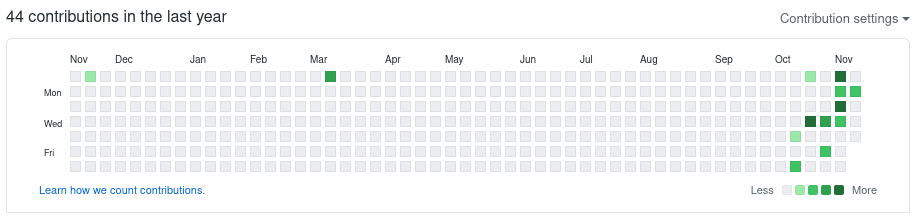

<h1> Twitter activity painel <h1>

# the ideia is to replicate the activity painel of github, but for the twitter activity

- Will be considerate:
    * number of Posts
    * number of likes (that the user gave)
    * number of retwits (that the user made)
    * number of saved twits

must read first: https://developer.twitter.com/en/docs/twitter-api
